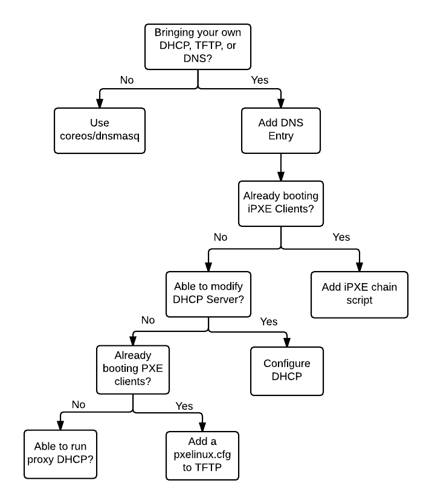

# Network Setup

This network setup guide shows how to setup a network boot environment (DHCP/TFTP/DNS) to network boot clients.

`bootcfg` serves iPXE scripts, GRUB configs, or Pixiecore JSON over HTTP and does not implement or exec a DHCP, TFTP, or DNS server. Instead, you should bring your own DHCP/TFTP/DNS setup or use the convenient [coreos/dnsmasq](../contrib/dnsmasq) image. Let's configure the network boot environment to point client machines to `bootcfg`.

If you're using `bootcfg` to serve Ignition and Cloud-config files to cloud instances (e.g. EC2, GCE, Azure) you don't need to setup a network boot environment. This guide is not for you.

*Note*: These are just suggestions. Your network administrator or system administrator should determine the right network setup.

## Requirements

Client hardware must have a network interface which supports PXE or iPXE.

## Goals

* Chainload PXE firmware to iPXE or GRUB2
* Point iPXE clients to `bootcfg.foo/boot.ipxe`
* Point GRUB clients to `bootcfg.foo/grub`

## DNS

Add a DNS entry so that `bootcfg.foo` resolves to a deployment of the CoreOS `bootcfg` server from machines you intend to boot and provision.

    dig bootcfg.foo

If you deployed `bootcfg` to a known IP address (e.g. dedicated host, load balanced endpoint, Kubernetes NodePort) and use `dnsmasq`, add a domain name to IPv4/IPv6 address mapping.

    # dnsmasq.conf
    address=/bootcfg.foo/172.15.0.2

## iPXE

Servers with DHCP/TFTP/HTTP services which already network boot iPXE clients can use the `chain` command to make clients download and execute the iPXE boot script from `bootcfg`.

    # /var/www/html/ipxe/default.ipxe
    chain http://bootcfg.foo:8080/boot.ipxe

You can chainload from a menu entry or use other [iPXE commands](http://ipxe.org/cmd) if you have needs beyond just delegating to the iPXE script served by `bootcfg`.

## GRUB

Needs docs.

### Configuring DHCP

Configure your DHCP server to supply Options to older PXE client firmware to specify the location of an iPXE or GRUB boot program on your TFTP server. Send iPXE clients to the `bootcfg` iPXE boot endpoint.

Here is an example `/etc/dnsmasq.conf`:

    dhcp-range=192.168.1.1,192.168.1.254,30m
    enable-tftp
    tftp-root=/var/lib/tftpboot
    # if request comes from older PXE ROM, chainload to iPXE (via TFTP)
    dhcp-boot=tag:!ipxe,undionly.kpxe
    # if request comes from iPXE user class, set tag "ipxe"
    dhcp-userclass=set:ipxe,iPXE
    # point ipxe tagged requests to the bootcfg iPXE boot script (via HTTP)
    dhcp-boot=tag:ipxe,http://bootcfg.foo:8080/boot.ipxe
    # verbose
    log-queries
    log-dhcp
    # disable DNS
    port=0
    # alternately, set DNS name
    # address=/bootcfg.foo/192.168.1.100

Add [unidonly.kpxe](http://boot.ipxe.org/undionly.kpxe) (and undionly.kpxe.0 if using dnsmasq) to `/var/lib/tftpboot`.

    sudo systemctl start dnsmasq
    sudo firewall-cmd --add-service=dhcp --add-service=tftp [--add-service=dns]
    sudo firewall-cmd --list-services

#### proxy DHCP

Alternately, a DHCP proxy server can be run alongside an existing non-PXE DHCP server. The proxy DHCP server provides only the next server and boot filename Options, leaving IP allocation to the DHCP server. Clients listen for both DHCP offers and merge the responses as though they had come from one PXE-enabled DHCP server.

Example `/etc/dnsmasq.conf`:

    dhcp-range=192.168.1.1,proxy,255.255.255.0
    enable-tftp
    tftp-root=/var/lib/tftpboot
    # if request comes from older PXE ROM, chainload to iPXE (via TFTP)
    pxe-service=tag:#ipxe,x86PC,"PXE chainload to iPXE",undionly.kpxe
    # if request comes from iPXE user class, set tag "ipxe"
    dhcp-userclass=set:ipxe,iPXE
    # point ipxe tagged requests to the bootcfg iPXE boot script (via HTTP)
    pxe-service=tag:ipxe,x86PC,"iPXE",http://bootcfg.foo:8080/boot.ipxe
    # verbose
    log-queries
    log-dhcp

Add [unidonly.kpxe](http://boot.ipxe.org/undionly.kpxe) (and undionly.kpxe.0 if using dnsmasq) to `/var/lib/tftpboot`.

    sudo systemctl start dnsmasq
    sudo firewall-cmd --add-service=dhcp --add-service=tftp [--add-service=dns]
    sudo firewall-cmd --list-services

With rkt:

    sudo rkt run coreos.com/dnsmasq:v0.2.0 --net=host -- -d -q --dhcp-range=192.168.1.1,proxy,255.255.255.0 --enable-tftp --tftp-root=/var/lib/tftpboot --dhcp-userclass=set:ipxe,iPXE --pxe-service=tag:#ipxe,x86PC,"PXE chainload to iPXE",undionly.kpxe --pxe-service=tag:ipxe,x86PC,"iPXE",http://bootcfg.foo:8080/boot.ipxe --log-queries --log-dhcp

With Docker:

    sudo docker run --net=host --rm --cap-add=NET_ADMIN quay.io/coreos/dnsmasq -d -q --dhcp-range=192.168.1.1,proxy,255.255.255.0 --enable-tftp --tftp-root=/var/lib/tftpboot --dhcp-userclass=set:ipxe,iPXE --pxe-service=tag:#ipxe,x86PC,"PXE chainload to iPXE",undionly.kpxe --pxe-service=tag:ipxe,x86PC,"iPXE",http://bootcfg.foo:8080/boot.ipxe --log-queries --log-dhcp

### Configurable TFTP

If your DHCP server is configured to PXE boot clients, but you don't have control over this configuration, you can modify the pxelinux.cfg served to PXE clients.

Example `/var/lib/tftpboot/pxelinux.cfg/default` (unverified):

    timeout 10
    default iPXE
    LABEL iPXE
    KERNEL ipxe.lkrn
    APPEND dhcp && chain http://bootcfg.foo:8080/boot.ipxe

Add ipxe.lkrn to `/var/lib/tftpboot` (see [iPXE docs](http://ipxe.org/embed)).

## coreos/dnsmasq Container

On networks without network services, the `coreos.com/dnsmasq:v0.2.0` ACI or `coreos/dnsmasq:latest` Docker image can setup an appropriate environment quickly. The images bundle `undionly.kpxe` and `grub.efi` for convenience.

Here are some examples which run a DHCP/TFTP/DNS server on the host. Ensure that `bootcfg.foo` points to an IP address where `bootcfg` is running.

With rkt:

    sudo rkt trust --prefix coreos.com/dnsmasq
    # gpg key fingerprint is: 18AD 5014 C99E F7E3 BA5F  6CE9 50BD D3E0 FC8A 365E
    sudo rkt run coreos.com/dnsmasq:v0.2.0 --net=host -- -d -q --dhcp-range=192.168.1.3,192.168.1.254 --enable-tftp --tftp-root=/var/lib/tftpboot --dhcp-userclass=set:ipxe,iPXE --dhcp-boot=tag:#ipxe,undionly.kpxe --dhcp-boot=tag:ipxe,http://bootcfg.foo:8080/boot.ipxe --address=/bootcfg.foo/192.168.1.2 --log-queries --log-dhcp

With Docker:

    sudo docker run --rm --cap-add=NET_ADMIN --net=host quay.io/coreos/dnsmasq -d -q --dhcp-range=192.168.1.3,192.168.1.254 --enable-tftp --tftp-root=/var/lib/tftpboot --dhcp-userclass=set:ipxe,iPXE --dhcp-boot=tag:#ipxe,undionly.kpxe --dhcp-boot=tag:ipxe,http://bootcfg.foo:8080/boot.ipxe --address=/bootcfg.foo/192.168.1.2 --log-queries --log-dhcp

Allow these services in your firewall settings.

    sudo firewall-cmd --add-service=dhcp --add-service=tftp --add-service=dns